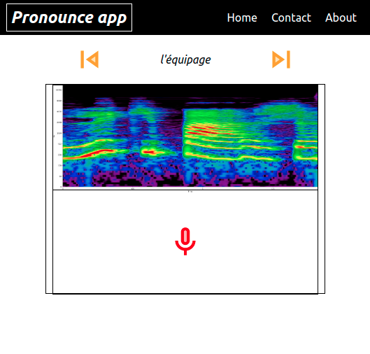

# pronounce_fend

Frontend of the pronounce app. Developed in react.



## Getting Started

First, run the development server:

```bash
yarn install
yarn run dev
# or
npm build
npm run dev
```
Open [http://localhost:3000](http://localhost:3000) with your browser to see the page.


## TODOs

```
Send sound to backend (Done)
Obtain its specto and send it back to front-end
Render new specto with old specto in the background
Compare spectros with AI and give feedback

# Validating:
*Record Sound
*Avoid automtic storing content: img/wav data and javaScript
*Backend should go better and faster on payed version
```


